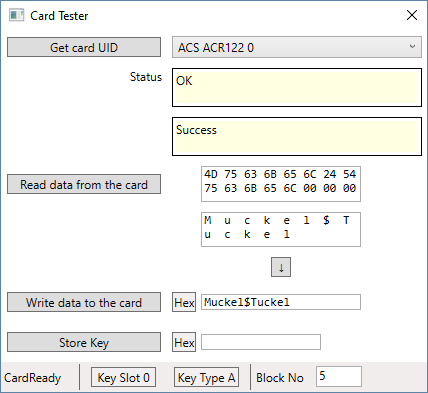

# SnappyWinscard

SnappyWinscard is a .NET interface for smart card readers like ACS ACR122U.

## Version History

### 1.0.0.3
Initial NuGet package, 32bit only.

### 1.0.1.0
Now also supports 64bit. Currently in beta state.

## NuGet
You can get the NuGet package [here](https://www.nuget.org/packages/SnappyWinscard/).

## Card Tester

The project _CardTest_ contains a desktop application that can show and test the capabilities of _SnappyWinscard_. Using this you can read and write data from and to your smartcard.